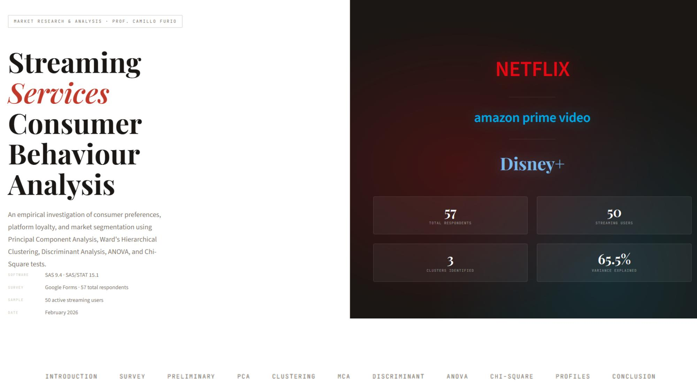
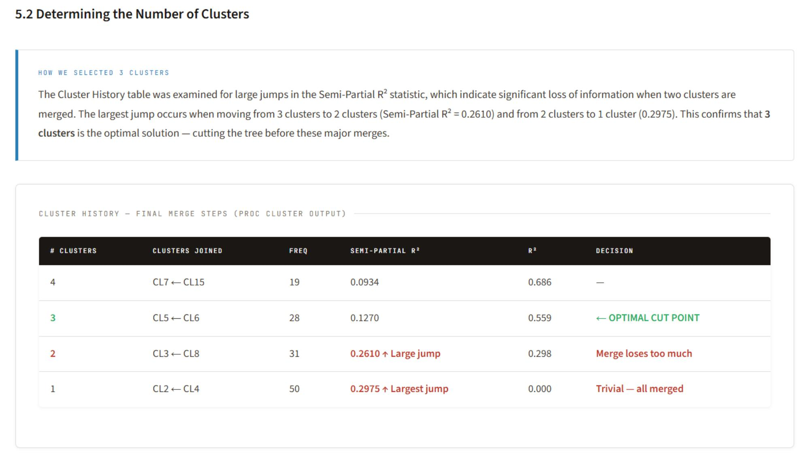
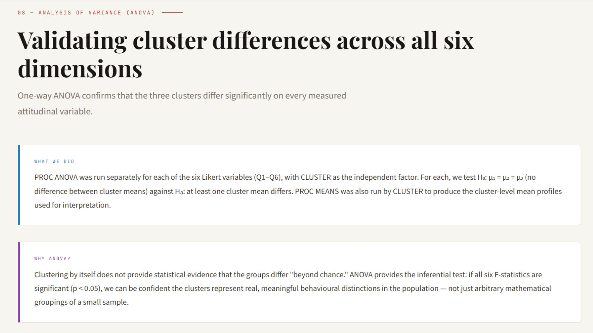
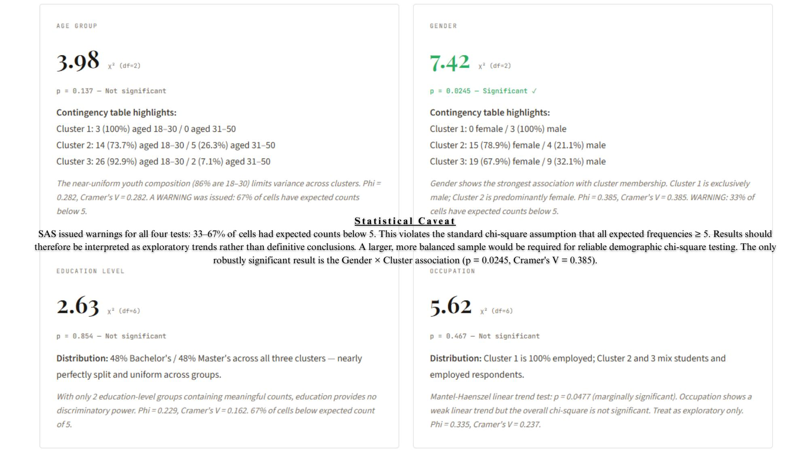
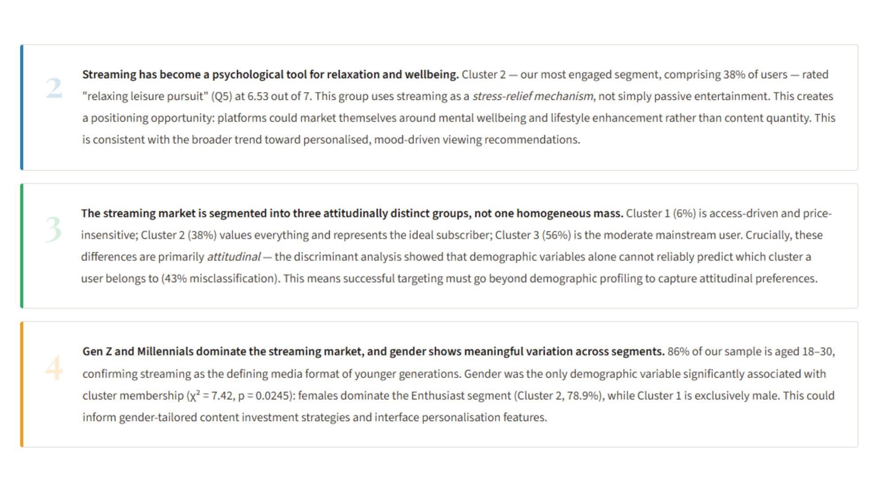

# Streaming Services Consumer Behaviour Analysis
### PCA → Ward Clustering → MCA → Discriminant Analysis → ANOVA → Chi-Square, in SAS 9.4

A multivariate market-research pipeline segmenting streaming-service consumers (Netflix,
Amazon Prime Video, Disney+, etc.) into distinct behavioural personas, using a full
SAS/STAT statistical workflow — from raw survey data to validated, actionable consumer
segments.



## Overview

50 active streaming users were surveyed on six attitudinal drivers (price, content
variety, time-saving, relaxation, 24/7 access, offers/deals) plus demographic and
platform-usage variables. The goal: identify whether distinct consumer segments exist,
what separates them, and which factors most reliably explain group membership —
combining unsupervised (PCA, clustering) and supervised/inferential (discriminant
analysis, ANOVA, chi-square) methods into one coherent pipeline.

## Data

- **Source:** Google Forms survey, 57 total respondents (Feb 2026); 50 confirmed active
  streaming users retained for analysis (7 non-users excluded).
- **Six core Likert variables (Q1–Q6, 1–7 scale):** better offers/discounts, low
  subscription price, content variety, time-saving, relaxation, 24/7 accessibility.
- **Demographics:** gender, age band, occupation, education level.
- **Behavioural variables:** platform(s) used, viewing frequency, monthly spend, primary
  device.

## Methodology

1. **Import & cleaning** (`PROC IMPORT`, `DATA` step) — raw Google Forms Excel export
   cleaned and renamed; filtered to the 50 confirmed streaming users with complete
   Likert responses.
2. **PCA** (`PROC STANDARD` + `PROC PRINCOMP`) — the six standardized Likert variables
   reduced to principal components (Kaiser criterion: eigenvalue > 1).
3. **Ward's hierarchical clustering** (`PROC CLUSTER` + `PROC TREE`) — respondents
   segmented into groups based on their PC1/PC2 scores.
4. **MCA via indicator matrix** (`PROC GLMMOD` + `PROC PRINCOMP`) — since SAS 9.4's
   `PROC CORRESP` requires a symmetric contingency table (not available here), the
   qualitative demographic/behavioural variables were instead converted to a
   dummy/indicator matrix and reduced via PCA — a standard, reliable substitute for
   true MCA in this SAS version.
5. **Discriminant analysis** (`PROC DISCRIM`, cross-validated) — tests whether cluster
   membership can be predicted from the qualitative (demographic) profile alone.
6. **ANOVA** (`PROC ANOVA`) — one-way ANOVA per Likert variable (Q1–Q6) to confirm the
   clusters differ significantly on the attitudes that defined them.
7. **Chi-square tests** (`PROC FREQ`) — association between cluster membership and each
   demographic variable (age, gender, education, occupation).

## Results

### PCA — two clear attitudinal dimensions (65.5% variance explained)

| Component | Eigenvalue | Variance | Cumulative |
|---|---|---|---|
| PC1 — "Service Value" (offers, price, variety) | 2.243 | 37.4% | 37.4% |
| PC2 — "Lifestyle Convenience" (time-saving, relaxation, 24/7 access) | 1.687 | 28.1% | 65.5% |

### Ward clustering — 3 segments

Selected by the largest jump in semi-partial R² in the cluster-merge history.

| Cluster | N | % | Persona |
|---|---|---|---|
| 1 | 3 | 6% | **The Access-Only Users** — price/variety nearly irrelevant; perfect 24/7-access score (7.00); 100% male, 100% employed |
| 2 | 19 | 38% | **The Enthusiasts** — highest scores across the board, especially content variety (6.63) and time-saving (6.58); 78.9% female |
| 3 | 28 | 56% | **The Balanced Majority** — moderate, broadly satisfied mainstream users; less passionate than Cluster 2 |



### Discriminant analysis — clusters are attitudinal, not demographic

Cross-validated classification accuracy from demographic/behavioural variables alone:
**56.4% error rate** (43.6% correct). This relatively high misclassification —
especially for Cluster 3 — indicates the clusters are driven by **attitudes**, not by
who the respondent is demographically. Successful targeting therefore requires
capturing attitudinal preference, not just demographic profiling.

### ANOVA — all six variables differ significantly across clusters

| Variable | F-value | p-value |
|---|---|---|
| Q3 — Content variety | **34.11** | <0.0001 |
| Q6 — 24/7 accessibility | 19.44 | <0.0001 |
| Q5 — Relaxation | 13.46 | <0.0001 |
| Q4 — Time-saving | 12.69 | <0.0001 |
| Q1 — Offers/discounts | 10.74 | 0.0001 |
| Q2 — Low price | 7.01 | 0.0022 |

**Content variety is the single strongest discriminator between segments** (F = 34.11,
R² = 0.592) — more than price, more than any other attitude tested.



### Chi-square — gender is the only significant demographic association

| Demographic | χ² | p-value | Significant? |
|---|---|---|---|
| Gender | 7.42 | 0.0245 | **Yes** |
| Age | 3.98 | 0.137 | No |
| Occupation | 5.62 | 0.467 | No |
| Education | 2.63 | 0.854 | No |

Gender shows the strongest (and only statistically robust) association with segment
membership: Cluster 1 is 100% male, Cluster 2 is 78.9% female. *Caveat: SAS flagged
33–67% of contingency-table cells with expected counts below 5 for all four tests, so
results besides the gender association should be read as exploratory given the small
sample.*



## Strategic recommendations

- **Content variety and 24/7 access — not price — are the primary loyalty drivers.**
  Platforms competing on price alone will lose to those with superior catalogues and
  availability.
- **Streaming has become a psychological tool for relaxation**, not just passive
  entertainment, for the most engaged segment (Cluster 2) — a positioning opportunity
  around wellbeing rather than content volume.
- **The market is attitudinally segmented, not demographically** — targeting needs to
  capture preference signals, not just demographic profiles.
- **For Cluster 2 (Enthusiasts):** invest in exclusive content and loyalty perks. **For
  Cluster 3 (Balanced Majority):** compete on catalogue depth and value messaging —
  this is the highest-volume, highest-churn-risk segment. **For Cluster 1
  (Access-Only):** prioritize reliability and cross-device access over price promotions.



## Repository structure

```
.
├── SASFinalProject.sas          # Full SAS 9.4 script: import → cleaning → PCA →
│                                 # Ward clustering → MCA → discriminant → ANOVA → chi-square
├── cover.jpg                    # Selected pages from the final report
├── ward_dendrogram.jpg
├── anova_results.jpg
├── cluster_personas.jpg
└── strategic_recommendations.jpg
```

## Tech stack

`SAS 9.4` / `SAS/STAT 15.1` — `PROC IMPORT`, `PROC STANDARD`, `PROC PRINCOMP`,
`PROC CLUSTER`, `PROC TREE`, `PROC GLMMOD`, `PROC DISCRIM`, `PROC ANOVA`, `PROC FREQ`

## How to run

1. Update the `PROC IMPORT` `datafile=` path at the top of `SASFinalProject.sas` to
   point to your own survey export (`.xlsx`, same column structure as described in the
   script comments).
2. Run the script top to bottom in SAS 9.4 / SAS Studio. Each `PROC` step is
   self-contained and produces its own output/plots.

## Course context

Statistics — Bologna Business School (2026).

## Results

### PCA — two clear attitudinal dimensions (65.5% variance explained)

| Component | Eigenvalue | Variance | Cumulative |
|---|---|---|---|
| PC1 — "Service Value" (offers, price, variety) | 2.243 | 37.4% | 37.4% |
| PC2 — "Lifestyle Convenience" (time-saving, relaxation, 24/7 access) | 1.687 | 28.1% | 65.5% |

### Ward clustering — 3 segments

Selected by the largest jump in semi-partial R² in the cluster-merge history.

| Cluster | N | % | Persona |
|---|---|---|---|
| 1 | 3 | 6% | **The Access-Only Users** — price/variety nearly irrelevant; perfect 24/7-access score (7.00); 100% male, 100% employed |
| 2 | 19 | 38% | **The Enthusiasts** — highest scores across the board, especially content variety (6.63) and time-saving (6.58); 78.9% female |
| 3 | 28 | 56% | **The Balanced Majority** — moderate, broadly satisfied mainstream users; less passionate than Cluster 2 |


### Discriminant analysis — clusters are attitudinal, not demographic

Cross-validated classification accuracy from demographic/behavioural variables alone:
**56.4% error rate** (43.6% correct). This relatively high misclassification —
especially for Cluster 3 — indicates the clusters are driven by **attitudes**, not by
who the respondent is demographically. Successful targeting therefore requires
capturing attitudinal preference, not just demographic profiling.

### ANOVA — all six variables differ significantly across clusters

| Variable | F-value | p-value |
|---|---|---|
| Q3 — Content variety | **34.11** | <0.0001 |
| Q6 — 24/7 accessibility | 19.44 | <0.0001 |
| Q5 — Relaxation | 13.46 | <0.0001 |
| Q4 — Time-saving | 12.69 | <0.0001 |
| Q1 — Offers/discounts | 10.74 | 0.0001 |
| Q2 — Low price | 7.01 | 0.0022 |

**Content variety is the single strongest discriminator between segments** (F = 34.11,
R² = 0.592) — more than price, more than any other attitude tested.


### Chi-square — gender is the only significant demographic association

| Demographic | χ² | p-value | Significant? |
|---|---|---|---|
| Gender | 7.42 | 0.0245 | **Yes** |
| Age | 3.98 | 0.137 | No |
| Occupation | 5.62 | 0.467 | No |
| Education | 2.63 | 0.854 | No |

Gender shows the strongest (and only statistically robust) association with segment
membership: Cluster 1 is 100% male, Cluster 2 is 78.9% female. *Caveat: SAS flagged
33–67% of contingency-table cells with expected counts below 5 for all four tests, so
results besides the gender association should be read as exploratory given the small
sample.*


## Strategic recommendations

- **Content variety and 24/7 access — not price — are the primary loyalty drivers.**
  Platforms competing on price alone will lose to those with superior catalogues and
  availability.
- **Streaming has become a psychological tool for relaxation**, not just passive
  entertainment, for the most engaged segment (Cluster 2) — a positioning opportunity
  around wellbeing rather than content volume.
- **The market is attitudinally segmented, not demographically** — targeting needs to
  capture preference signals, not just demographic profiles.
- **For Cluster 2 (Enthusiasts):** invest in exclusive content and loyalty perks. **For
  Cluster 3 (Balanced Majority):** compete on catalogue depth and value messaging —
  this is the highest-volume, highest-churn-risk segment. **For Cluster 1
  (Access-Only):** prioritize reliability and cross-device access over price promotions.


## Repository structure

```
.
├── SASFinalProject.sas          # Full SAS 9.4 script: import → cleaning → PCA →
│                                 # Ward clustering → MCA → discriminant → ANOVA → chi-square
├── cover.jpg                    # Selected pages from the final report
├── ward_dendrogram.jpg
├── anova_results.jpg
├── cluster_personas.jpg
└── strategic_recommendations.jpg
```

## Tech stack

`SAS 9.4` / `SAS/STAT 15.1` — `PROC IMPORT`, `PROC STANDARD`, `PROC PRINCOMP`,
`PROC CLUSTER`, `PROC TREE`, `PROC GLMMOD`, `PROC DISCRIM`, `PROC ANOVA`, `PROC FREQ`

## How to run

1. Update the `PROC IMPORT` `datafile=` path at the top of `SASFinalProject.sas` to
   point to your own survey export (`.xlsx`, same column structure as described in the
   script comments).
2. Run the script top to bottom in SAS 9.4 / SAS Studio. Each `PROC` step is
   self-contained and produces its own output/plots.

## Course context

Market Research & Analysis — Bologna Business School (2026).
